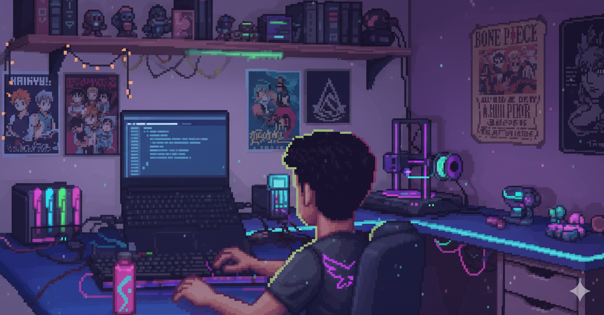

  

# 👋 Hi, I'm Goshan JB

---

### 🚀 About Me

- **Pre-final year student** @ Vellore Institute of Technology
- **Full Stack Developer** | **Pythonist** | **AI/ML Enthusiast**
- **Hobby:** Game developer (recently exploring VR!)

---

### 🛠️ Top Skills

- Full Stack Development (React, Node, Django, etc.)
- Python Programming
- AI & Machine Learning
- Game Development (Unity, VR)

---

### 🌟 Projects

- **Summarized Flash Card Generation using NLP:**  
  Generate concise flash cards from large texts using natural language processing.

- **Footstep Tracker:**  
  A full stack app to track footsteps, count energy burnt, and display stats visually.

---

### 🎮 Fun Fact

When I’m not coding for class or projects, I’m probably building a game, experimenting with VR worlds, or trying out new tech for fun!

---

<!-- Minimalistic animated theme: clean sections, emoji icons, and a simple GIF. You can swap the GIF above for your own! -->
